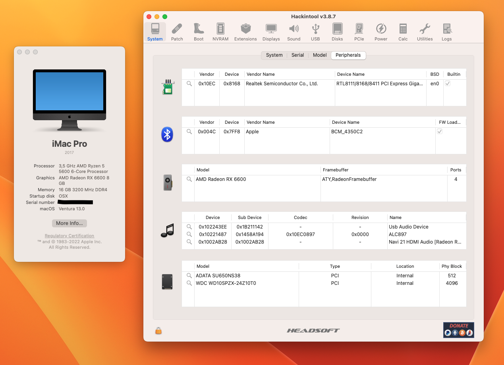

# EFI-RYZEN-B550-RX6600

:information_source: **The current version is fully macOS Monterey and Ventura compatible.**
OpenCore, drivers, and kexts are always up to date!

 

:warning: **DISCLAIMER:**
This is not a guide, please refer to [Dortania](https://dortania.github.io/getting-started/) before doing anything. I am not responsible for any damage. This OpenCore configuration is optimized for my specific hardware, so please use it only as a reference or if you happen to have the same or similar hardware.

## :computer: Hardware:

| **Category** | **Component**                                                              |
| ------------ | -------------------------------------------------------------------------- |
| **CPU**      | Ryzen 5600                                                                 |
| **GPU**      | ASROCK RX 6600 Challenger 8GB                                              |
| **RAM**      | 16GB GLOWAY DDR4 3200MHZ                                                   |
| **CHIPSET**  | B550 [Gigabyte](https://www.gigabyte.com/Motherboard/B550M-DS3H-rev-1x#kf) |
| **SSD**      | 120GB ADATA SATA                                                           |
| **Wi-Fi/BT** | -                                                                          |
| **Ethernet** | Realtek RTL8111                                                            |
| **Audio**    | Realtek ALC897 (layout-id=11)                                              |

## :white_check_mark: Working:

- [x] CPU power management.
- [x] Graphics acceleration.
- [x] Keyboard & Mouse
- [ ] Wi-Fi.
- [ ] Bluetooth.
- [x] USB ports.
- [x] HDMI video & audio output.
- [x] Ethernet.
- [x] Audio (Internal speakers, 3.5mm headphone jack).
- [x] Internal microphone.
- [x] VGA WebCam.
- [ ] AirDrop & Handoff.
- [x] iCloud & App Store.
- [x] iMessage & FaceTime.

## :x: Not working:

Wi-fi, Bluetooth and AirDrop are not working since i don't have yet a native Wi-fi card and my motherboard doesn't have one.
Currently using with wired network on my ethernet port

## :closed_lock_with_key: SMBIOS

You will need to generate your own SMBIOS and configure, since is required to fully work with macOS. As per this [guide](https://dortania.github.io/OpenCore-Install-Guide/AMD/zen.html#platforminfo) you can use the following SMBIOS: iMacPro1,1 or MacPro7,1. Note that if your hardware is different for the one mentioned [here](#computer-hardware) you have tho choose an appropriate SMBIOS, more details in the [guide](https://dortania.github.io/OpenCore-Install-Guide/AMD/zen.html).

Use [GenSMBIOS](https://github.com/corpnewt/GenSMBIOS) to generate your own unique SMBIOS and then copy each parametter following path (recomended to follow the guide above):

- Config.plist -> PlatformInfo -> Generic

## BIOS setup:

## Credits:

[**Apple**](http://apple.com/)

[**Acidanthera**](https://github.com/acidanthera)

[**Dortania**](https://dortania.github.io/getting-started/)

[**Gabriel Luchina**](https://luchina.com.br)
