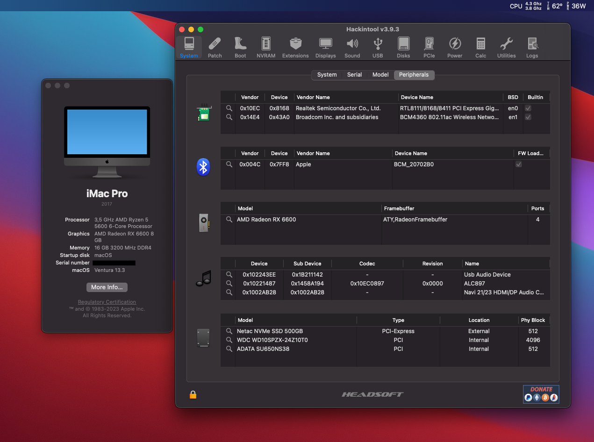
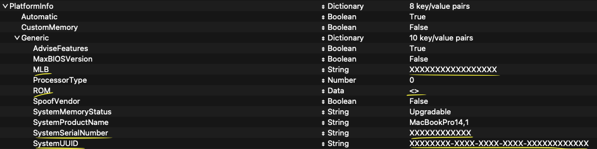

# EFI-RYZEN-B550-RX6600

:information_source: **The current version is fully macOS Monterey and Ventura compatible.**
OpenCore, drivers, and kexts are always up to date!

 

:warning: **DISCLAIMER:**
THIS IS NOT A GUIDE!
 
It's just my complete EFI for my hardware based on my experiments, please refer to [Dortania](https://dortania.github.io/getting-started/) before doing anything. I am not responsible for any damage. This OpenCore configuration is optimized for my specific hardware, so please use it only as a reference or if you happen to have the same or similar hardware.

## :computer: Hardware:

| **Category** | **Component**                                                                    |
| ------------ | -------------------------------------------------------------------------------- |
| **CPU**      | 3,5 GHz AMD Ryzen 5 5600 6-Core Processor                                        |
| **GPU**      | ASROCK Challenger - AMD Radeon RX 6600 8 GB Challenger 8GB                       |
| **RAM**      | 16GB GLOWAY DDR4 3200MHZ (XMP)                                                   |
| **CHIPSET**  | B550M DS3H [Gigabyte](https://www.gigabyte.com/Motherboard/B550M-DS3H-rev-1x#kf) |
| **SSD**      | 120GB ADATA SATA                                                                 |
| **Wi-Fi/BT** | Fenvi FV-HB1200                                                                  |
| **Ethernet** | Realtek RTL8111                                                                  |
| **Audio**    | Realtek ALC897 (layout-id=12)                                                    |

## :white_check_mark: Working:

- [x] CPU power management.
- [x] Graphics acceleration.
- [x] Keyboard & Mouse
- [x] Wi-Fi.
- [x] Bluetooth.
- [x] USB ports.
- [x] HDMI video & audio output.
- [x] Ethernet.
- [x] Audio (Internal speakers, 3.5mm headphone jack).
- [x] Internal microphone.
- [x] VGA WebCam.
- [x] AirDrop & Handoff.
- [x] iCloud & App Store.
- [x] iMessage & FaceTime.

## :x: Not working:

~~Wi-fi, Bluetooth and AirDrop are not working since i don't have yet a native Wi-fi card and my motherboard doesn't have one.
Currently using with wired network on my ethernet port~~

All features are working, just added a Fenvi FV-HB1200 board. Now we have Wi-Fi, Bluetooth (usb mapped), AirDrop and others.

## :closed_lock_with_key: SMBIOS

You will need to generate your own SMBIOS and configure, since is required to fully work with macOS. As per this [guide](https://dortania.github.io/OpenCore-Install-Guide/AMD/zen.html#platforminfo) you can use the following SMBIOS: iMacPro1,1 or MacPro7,1. Note that if your hardware is different for the one mentioned [here](#computer-hardware) you have tho choose an appropriate SMBIOS, more details in the [guide](https://dortania.github.io/OpenCore-Install-Guide/AMD/zen.html).

Use [GenSMBIOS](https://github.com/corpnewt/GenSMBIOS) to generate your own unique SMBIOS and then copy each parametter following path (recomended to follow the guide above):

- Config.plist -> PlatformInfo -> Generic

## BIOS setup:

**If you wan't to use Resizable Bars as Auto to work on Windows, u need to change on the config.plist, the ResizeAppleGpuBars key from -1 to a number greater than 0**

## Credits:

[**Myself**](https://github.com/gabrielcasag)

[**Gabriel Luchina**](https://luchina.com.br)

[**Acidanthera**](https://github.com/acidanthera)

[**Dortania**](https://dortania.github.io/getting-started/)

[**Apple**](http://apple.com/)
